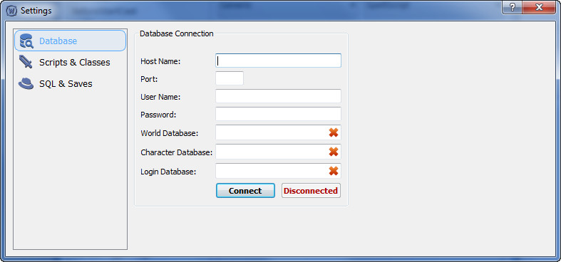
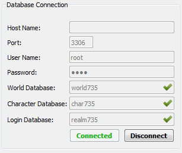

## Database

Данное окно необходимо для настройки подключения к базе данных.
> *Имееться ввиду, та база данных, в которую программа будет заливать новые SQL после обновления ядра.*

| Название поля | Описание |
|:----|----|
| **Host Name:** | Адрес подключения. Обычно это локальное подключение, по этому можно оставить поле пустым. Программа автоматически подключится к локальному адресу ***127.0.0.1***. |
| **Port:** | Порт подключения. |
| **User Name:** | Логин подключения. Обычно используется ***root***
| **Password:** | Пароль подключения. Обычно при локальном подключении так же используется ***root*** | 
| **World Database:** | Имя базы данных мира. |
| **Character Database:** | Имя базы данных персонажей. |
| **Login Database:** | Имя базы данных логина. |

Если правильно ввести данные и нажать кнопку ***Connect*** - должно получится примерно так:

---

#### Перейти на:

- [Главная](../../README.md)
- [Руководство по настройке](Settings.md)
- [Настройка Scripts & Classes](ScriptsAndClasses.md)
- [Настройка SQL & Saves](SQLAndSaves.md)
