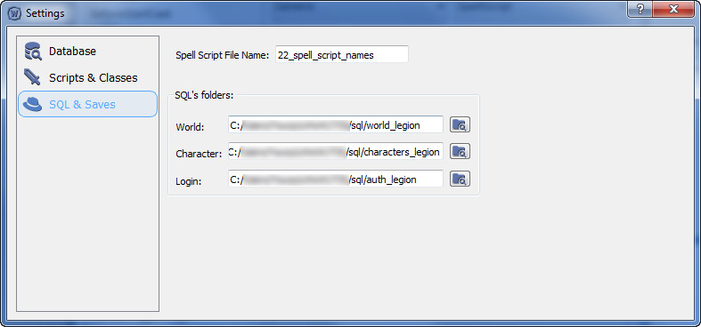

## SQL & Saves

В этом окне настройки связаны с SQL файлами.

| Поле | Описание |
|-|-|
|**Spell Script File Name:**|Название файла, которое будет создаваться в момент, когда мы генерируем скрипт. В этом файле будет находиться SQL код регистрации этого скрипта для базы данных. Этот файл нужен для отправки в репозиторий.|
|**World:**|Путь к папке где хранятся SQL файлы ***мира*** необходимые для обновления базы данных.|
|**Character:**|Путь к папке где хранятся SQL файлы ***персонажей*** необходимые для обновления базы данных.|
|**Login:**|Путь к папке где хранятся SQL файлы ***авторизации*** необходимые для обновления базы данных.|

---

#### Перейти на:

- [Главная](../../README.md)
- [Руководство по настройке](Settings.md)
- [Настройка Database](Database.md)
- [Настройка Scripts & Classes](ScriptsAndClasses.md)
