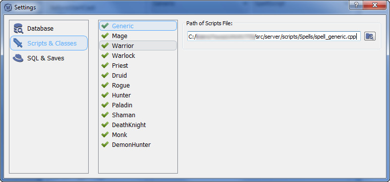

## Scripts & Classes

Данная настройка необходима для генерации кода. Необходимо для каждого класса указать его файл скриптов. 

**Примечание:**
Файл для скриптов обязательно должен быть с расширением ***.cpp*** и иметь реализацию метода с приставкой ***AddSC***. В противном случае - программа не опознает файл и не будет с ним работать.
>*Методы с приставкой ***AddSC*** есть в каждом файле скриптов (обычно находятся внизу файла). 
>Служат для регестрации классов этих скриптов.*

---

#### Перейти на:

- [Главная](../../README.md)
- [Руководство по настройке](Settings.md)
- [Настройка Database](Database.md)
- [Настройка SQL & Saves](SQLAndSaves.md)