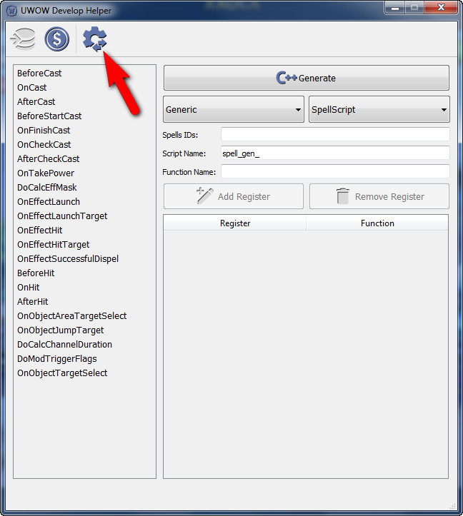
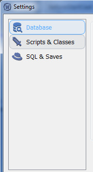

## Руководство по настройке

В главном окне программы нажмите кнопку настроек.

В появившимся окне будет 3 категории, которые необходимо настроить:

- [Database](Database.md)
- [Scripts & Classes](ScriptsAndClasses.md)
- [SQL & Saves](SQLAndSaves.md)

#### Перейти на:

- [Главная](../../README.md)

